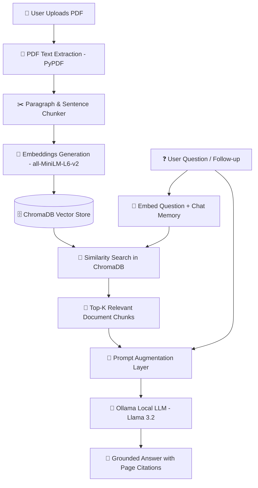

# 📚 AI Document Search — Multi-PDF RAG Chatbot

An intelligent, local **Retrieval-Augmented Generation (RAG)** chatbot that lets you upload multiple PDF documents, search through complex notes or documentation, and receive grounded answers with exact source and page citations powered by **Llama 3.2** and **ChromaDB**.

---

## 🌟 Features

- 📄 **Multi-PDF Document Ingestion**: Upload, index, and manage multiple PDF documents simultaneously.
- ✂️ **Smart Sentence-Boundary Chunking**: Extracts and splits document text into semantic 1,000-character chunks with overlap while filtering out table-of-contents noise.
- 🧠 **Dense Semantic Embeddings**: Converts text chunks into vector embeddings using Hugging Face's `all-MiniLM-L6-v2` (`sentence-transformers`).
- 🗄️ **Persistent Vector Storage**: Stores and queries document vectors locally with **ChromaDB**.
- 🎯 **Targeted Search Scope Filter**: Filter and constrain queries to specific documents or search across the entire knowledge base.
- 🤖 **Local LLM Inference with Ollama**: Runs **Llama 3.2** locally on your machine with low temperature controls for zero hallucination.
- 💬 **Multi-Turn Conversation Memory**: Understands context and follow-up prompts (e.g. *"give important questions"*, followed by *"now for 7 marks"*).
- 📑 **Exact Page Citations & Previews**: Expandable citation accordions show the exact file name, page number, and text chunk snippet.
- 📜 **Persistent Chat Sessions**: Automatically saves previous chat histories to disk with session switching and deletion.
- 📥 **Export Chat as Markdown**: Download complete conversation logs with citations with one click.
- 🎨 **Modern WhatsApp / ChatGPT UI**: Sleek right-aligned user bubbles, left-aligned AI assistant cards, stats badges, and status toasts.

---

## 🏗️ Architecture & Workflow



---

## 🛠️ Tech Stack

| Component | Technology | Purpose |
|---|---|---|
| **Frontend UI** | [Streamlit](https://streamlit.io/) | Interactive web dashboard & chat interface |
| **PDF Extraction** | [PyPDF](https://pypi.org/project/pypdf/) | Fast, lightweight text and page extraction |
| **Embeddings** | [Sentence-Transformers](https://www.sbert.net/) | `all-MiniLM-L6-v2` dense vector representations |
| **Vector Database** | [ChromaDB](https://www.trychroma.com/) | Persistent vector indexing and metadata filtering |
| **LLM Engine** | [Ollama](https://ollama.com/) | Local model runner for `llama3.2` |
| **Persistence** | JSON / Local Filesystem | Document storage and session history tracking |

---

## 🚀 Getting Started

### 1. Prerequisites
- **Python 3.10+**
- **Ollama installed**: Download from [ollama.com](https://ollama.com)

### 2. Pull the Local AI Model
In your terminal, run:
```bash
ollama pull llama3.2
```

### 3. Clone & Setup Environment
```bash
# Clone the repository
git clone https://github.com/your-username/AI-Document-Search.git
cd AI-Document-Search

# Create virtual environment
python -m venv env

# Activate virtual environment
# Windows:
.\env\Scripts\activate
# macOS/Linux:
source env/bin/activate

# Install dependencies
pip install -r requirements.txt
```

### 4. Run the Application
```bash
streamlit run app.py
```
Open **[http://localhost:8501](http://localhost:8501)** in your browser.

---

## 📂 Project Structure

```text
AI-Document-Search/
│
├── app.py                      # Streamlit application UI & session controller
├── requirements.txt            # Python dependencies
├── README.md                   # Project documentation
├── .gitignore                  # Git ignore rules
│
├── src/
│   ├── __init__.py
│   ├── pdf_loader.py           # PDF text & page extraction
│   ├── chunker.py              # Semantic boundary text chunking
│   ├── embeddings.py           # Cached SentenceTransformer embedding generator
│   ├── vector_store.py         # ChromaDB persistence, upsert & delete
│   └── rag.py                  # RAG retrieval, chat memory & prompt synthesis
│
├── data/
│   ├── documents/              # Stored PDF files
│   └── chat_history/           # Saved chat sessions (JSON)
│
├── chroma_db/                  # Local ChromaDB vector database files
│
└── tests/
    ├── test_pdf.py             # Verify PDF text extraction
    ├── test_chunker.py         # Verify text chunk splitting
    ├── test_embeddings.py      # Verify embedding generation
    ├── test_vector_store.py    # Verify vector upsert & search
    └── test_rag.py             # Verify end-to-end RAG output
```

---

## 📖 How RAG Works

1. **Document Processing**: When a PDF is uploaded, `pdf_loader.py` extracts raw text and tracks the exact page numbers.
2. **Chunking**: `chunker.py` divides the text into 1,000-character blocks with 150-character overlaps, breaking only at sentence and paragraph boundaries while discarding table-of-contents filler dots.
3. **Embedding & Vector Storage**: Each chunk is transformed into a 384-dimensional dense vector by `embeddings.py` and stored in `vector_store.py` with metadata (`document`, `page`).
4. **Contextual Retrieval**: When a question is asked, `rag.py` creates a vector representation of the query (augmented with recent conversational memory for follow-ups) and performs a cosine similarity search in ChromaDB.
5. **Prompt Augmentation & Generation**: The top-5 retrieved chunks are formatted into a strict system prompt and sent to `llama3.2` via Ollama, generating an accurate answer with exact document citations.

---

## 💡 Example Queries

- 📌 *"Summarize the key concepts in Chapter 1"*
- ❓ *"What is the difference between Supervised and Unsupervised Learning?"*
- 🎯 *"Give 5 important 2-mark questions with answers from Unit 1"*
- 🔄 Follow-up: *"Now give a 7-mark question on the first topic"*

---

## 📄 License
MIT License. Feel free to use and adapt this project for your portfolio or study purposes!
